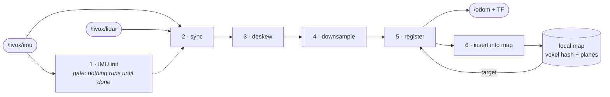

# glass-LIO

[](#license)
[](#dependencies)
[](#layout)
[](config/livox_mid_360.yaml)
[](#documentation)

**A transparent LiDAR-inertial odometry for Livox — written to be read.**


*Scan-to-map odometry on the test bag: each ~100 ms Livox sweep is deskewed with the
gyro, registered against the accumulated voxel-plane map, and folded back into it. The
pose you see is `/glasslio_node/odom` — no ground truth, no loop closure.*

---

Most SLAM code is written to *run*. This one is written to be **understood**. It is a
working scan-to-map LiDAR-inertial odometry — deskew, voxel-plane mapping, point-to-plane
ICP solved by Gauss-Newton on SE(3) — and every non-obvious decision in it is written down
and justified, including the ones that turned out to be wrong.

The real subject is **Lie algebra and least squares on a manifold**, taught through a system
where getting them subtly wrong still produces plausible output. New to the Lie theory side?
Start with [this primer on Lie algebra](https://aalok.uk/projects/lietheory/).

> ### The thing that makes this domain hard
>
> **Every serious bug in this project produced plausible output. Not one of them crashed.**
>
> A sign-flipped Jacobian still converges. A Jacobian that has silently lost its
> first-order term still runs. A plane fitted *perpendicular* to the actual wall still gives
> ICP something to chew on. There is no stack trace, no NaN, no red text — just a
> trajectory that is quietly, confidently wrong.
>
> That single fact dictates the architecture, the tests, and the docs. See
> **[doc/testing.md](doc/testing.md)**.

---

## What it does



A Livox scan is a **~100 ms sweep, not a snapshot**. We integrate the gyro on SO(3) to
undistort it (*deskew*), voxel-downsample it, *register* it against a voxel-hash local map
to get a pose, then insert the aligned scan back into that map. The loop closes on itself —
which is both the reason it works and its central hazard.

**Status: it holds real time (10 Hz) on the test bag — zero scans dropped, zero diverged,
`rmse` steady at ~0.13 m.**


## Why glasslio

- **Every stage has a write-up, in execution order** — six stage docs plus the solver, each
  one explaining the trap that stage sets, not just the code it runs ([docs](#documentation)).
- **The bugs are documented, not hidden** — including the ones still standing: tight coupling
  is built, unit-verified, and **diverges on the real bag**, and the *why* is written down.
- **No Ceres, no GTSAM, no g2o** — the manifold least-squares solver is under 200 lines of
  Eigen and you are meant to read it ([`gauss_newton.hpp`](include/glasslio/gauss_newton.hpp)).
- **The tests are oracles, not smoke tests** — finite differences pin every Jacobian; mutation
  testing checks that the tests would actually notice ([doc/testing.md](doc/testing.md)).
- **One command to a running node** — Dockerfile + devcontainer pinned to Jazzy, and a
  checksum-verified test bag ([Quickstart](#quickstart)).

## Quickstart

### Try it in Docker (no ROS install)

```bash
./docker/run.sh ./scripts/download_bag.sh          # fetch the bag (once)
./docker/run.sh colcon build --packages-select glasslio
./docker/run.sh                                    # drop into a shell, then: ./src/glasslio/scripts/run_bag.sh
```

The image is pinned to **ROS 2 Jazzy on Ubuntu Noble** and installs the package's own
dependencies straight from `package.xml` via `rosdep`, so it cannot drift from the manifest.
The repo mounts as the `src/` of a workspace at `/ws`; build artefacts stay inside the
container, so they never collide with a host build of the same tree.

[`docker/Dockerfile`](docker/Dockerfile) is a **plain image with no editor specifics** —
build it by hand, drop it in your own compose file, or use it in CI.

<details>
<summary><b>Or in VS Code (devcontainer)</b></summary>

1. Install the **Dev Containers** extension (`ms-vscode-remote.remote-containers`).
2. Open the repo, then **F1 → “Dev Containers: Reopen in Container”.**
3. First build takes a few minutes. On create it fetches the test bag automatically
   (~1.4 GB — comment out `postCreateCommand` in
   [`.devcontainer/devcontainer.json`](.devcontainer/devcontainer.json) to skip that).

You land in a shell at `/ws` with ROS and the workspace overlay already sourced, C++
IntelliSense wired to `compile_commands.json`, and the repo mounted at `/ws/src/glasslio`.
From there:

```bash
colcon build --packages-select glasslio
colcon test  --packages-select glasslio
./src/glasslio/scripts/run_bag.sh -n     # headless
```

It wraps the *same* [`docker/Dockerfile`](docker/Dockerfile) — the devcontainer is a
convenience, not a second source of truth.

</details>

<details>
<summary><b>Or on a host with ROS 2 Jazzy</b></summary>

```bash
# build
colcon build --packages-select glasslio

# fetch the test bag (~1.4 GB, from Zenodo -- resumable, checksum-verified)
./scripts/download_bag.sh

# run it (node + RViz, on an isolated ROS domain)
./scripts/run_bag.sh
./scripts/run_bag.sh -n        # headless
./scripts/run_bag.sh -l        # loop the bag (exercises the estimator reset path)

# the self-checks
colcon test --packages-select glasslio
```

The bag is **not** in the repo — it is 1.4 GB, so `data/` is gitignored and
`download_bag.sh` fetches it. Re-running the script is safe: if the bag is already
there and its checksum matches, it does nothing.

</details>

Output: `/glasslio_node/odom` (`nav_msgs/Odometry`) plus a TF `odom → livox_frame`.

Configuration lives in **[`config/livox_mid_360.yaml`](config/livox_mid_360.yaml)**, which
is heavily commented — the parameters that actually bite are explained where they are set,
not in a table somewhere else.

## Running it on your own sensor

Four things decide whether this works on hardware that is not a Mid-360. Three of them fail
**silently** — you get a plausible-looking trajectory, not an error.

**1. Topics** — [`config/livox_mid_360.yaml`](config/livox_mid_360.yaml):

```yaml
lidar_topic: "/livox/lidar"
imu_topic:   "/livox/imu"
scan_guard_sec: 0.12     # must EXCEED your scan period (0.1 s at 10 Hz)
```

**2. The point layout.** [`livox_point.hpp`](include/glasslio/livox_point.hpp) must match your
driver's `PointCloud2` fields exactly. Check yours before assuming:

```bash
ros2 topic echo /livox/lidar --once | head -30      # look at the `fields:` list
```

Here, per-point time is a `timestamp` field in **nanoseconds** — and it is **not** packed into
`intensity` (that is genuine reflectivity). Some LOAM-derived drivers do pack time into
`intensity`; read it from the wrong place and deskew silently becomes a **no-op**.

**3. The IMU's units.** `imu.accel_in_g: true` for Livox, which reports **g**, not m/s² — a
`sensor_msgs/Imu` spec violation. Check yours in one line:

```bash
ros2 topic echo /livox/imu --once     # |linear_acceleration| at rest: ~1.0 => g,  ~9.81 => SI
```

Get it wrong and every acceleration is 9.81× off. Deskew is gyro-only, so it will not notice —
this only detonates when something integrates acceleration.

**4. The extrinsic.** `extrinsic.lidar_to_imu.quat_xyzw` is identity on the Mid-360 (its
internal IMU axes are aligned with the lidar frame) — **that is genuinely correct here, not a
placeholder.** On an Avia, or with an external IMU, it is not identity, and a wrong value does
not obviously break: it **tilts** the deskew rather than disabling it, so the cloud still looks
deskewed. See [3-deskew.md §5](doc/3-deskew.md).

The rest (`voxel_leaf_size`, `map.voxel_size`, `registration.max_correspondence_distance`) is
tuning, and every one of them is commented where it is set.

## Documentation

The docs are the point. Start with **[doc/pipeline.md](doc/pipeline.md)** — the spine — and
follow the stages in execution order.

| | Doc | What it covers |
|---|---|---|
| **1** | [IMU init](doc/1-imu-init.md) | Static-window detection, the **units trap** (accel in *g*), gravity alignment, and why yaw is deliberately left at zero |
| **2** | [Sync](doc/2-sync.md) | Bracketing a scan with the IMU that spans it, and why consumed IMU is *not* eagerly dropped |
| **3** | [Deskew](doc/3-deskew.md) | SO(3) gyro integration, SLERP between knots, the extrinsic **conjugation**, and the per-point timestamp traps |
| **4** | [Downsample](doc/4-downsample.md) | The leaf-size trade, and why the **map** is fed the dense cloud while ICP is fed the sparse one |
| **5** | [Register](doc/5-registration.md) | Predict → associate → solve → accept. Point-to-plane, the Jacobian, and the constant-velocity runaway |
| **6** | [Local map](doc/6-local-map.md) | Voxel hash, cached planes, `floor` vs `int`, and the acceptance test that tells you the pose is right |

**Companions:**

- **[gauss-newton.md](doc/gauss-newton.md)** — the solver. The normal equations *derived*,
  what the Gauss-Newton approximation throws away, LDLT, Huber, the **retraction**, and why
  we run with neither damping nor line search.
- **[7-tight-coupling.md](doc/7-tight-coupling.md)** — the IMU as a **residual in the same
  normal equations**, not merely a hint: on-manifold preintegration, the 15-DoF state,
  `J_r⁻¹`, and why it is currently **off by default**.
- **[testing.md](doc/testing.md)** — **how the bugs were actually found.** Finite-difference
  oracles, mutation testing, and why "all tests pass" is never the last step.

## The idea worth stealing

**The optimizer does not know what a point cloud is.**

[`gauss_newton.hpp`](include/glasslio/gauss_newton.hpp) owns the *generic* half — normal
equations, robust weighting, the LDLT solve, and the retraction back onto the manifold.
[`registration.cpp`](src/lio/registration.cpp) supplies only the LiDAR-specific half:
**association** (hash the point to its voxel, take the nearest plane) and the residual.

That split is not tidiness. Swap the residual and the same solver becomes a different
estimator — and it is exactly the seam the IMU prior plugs into:

$$
\mathbf{H} =
\underbrace{\sum_i \tfrac{1}{\sigma^2}\,\mathbf{J}_i^\top \mathbf{J}_i}_{\text{LiDAR}}
\;+\;
\underbrace{\mathbf{J}_{\text{imu}}^\top \boldsymbol{\Sigma}^{-1} \mathbf{J}_{\text{imu}}}_{\text{IMU}}
$$

**That sum *is* the sensor fusion.** No filter, no blending coefficient — just Jacobians
stacked into one linear system, each weighted by how much it actually knows. Where the
geometry is degenerate (a corridor), the LiDAR term has a **null space** and the IMU is the
only thing there, so it takes over exactly where it is needed, with no mode switch.

And the punchline: **loose coupling is tight coupling with $\boldsymbol{\Sigma}^{-1} = 0$.**
The two are the same estimator with one block zeroed, which is what lets a single parameter
select between them.

## Current state

| Stage | Status |
|---|---|
| IMU init, sync, deskew, downsample | ✅ Working, self-checked |
| Register (point-to-plane ICP on SE(3)) | ✅ Working, holds real time |
| Local map (voxel hash + cached planes) | ✅ Working, self-checked |
| **Tight coupling (15-DoF, preintegration)** | ⚠️ **Built and verified — but OFF by default** |

Tight coupling passes every unit test — preintegration matches brute-force integration to
1e-14, every Jacobian is pinned against finite differences, and on a synthetic corridor it
recovers the axis the LiDAR *cannot see* (0.40 m → 0.00 m error).

**Then it diverges on the real bag**, and the reason is structural rather than a typo:
`x_i` is held **fixed and infinitely certain**, and gravity is not a state — so a tilt error
in the world frame can never be corrected. **What we built is a factor, not a filter.**

The instructive part is what happened when we tried to fix it by hand. The accel bias was
frozen, so we gave it a carried covariance and let the data move it — and **rejections went
from 266 to 579.** Loosening one block while `x_i` stayed infinitely stiff meant every error
that belonged to `x_i` got shovelled into the only free variable in the system. *You cannot
fix a filter by loosening one block of a factor.*

Full write-up — including the two bugs that **were** fixed along the way —
[7-tight-coupling.md](doc/7-tight-coupling.md). The failure taught more than the success
would have.

**Not implemented:** loop closure (this is odometry, not SLAM — the map deliberately
forgets), and translational deskew (it needs a velocity we do not yet trust).

## Three landmines in this sensor set

Each cost real debugging time, and each produced *plausible output* rather than an error:

1. **Per-point `timestamp` is nanoseconds** — and the time is **not** in `intensity` (that
   field is genuine reflectivity here). Mix the units and every lookup clamps, and deskew
   silently becomes a no-op.
2. **`linear_acceleration` is in *g*, not m/s²** — a `sensor_msgs/Imu` spec violation.
   Measured at rest: `|a|` = 0.997. Get it wrong and every acceleration is 9.81× too small.
3. **Release builds define `NDEBUG`, which deletes every `assert()`.** The `assert`-based
   suites passed *while checking nothing at all* until `-UNDEBUG` was forced in CMake.

## Layout

```
include/glasslio/     the library headers — each one is the doc for its stage
  types.hpp             the shared vocabulary (CloudXYZI, MeasureGroup) — depends on nothing
  gauss_newton.hpp      generic manifold least squares (knows nothing about LiDAR)
  so3_jacobian.hpp      the SO(3) right Jacobian — the one bit Sophus does not give you
  preintegration.hpp    on-manifold IMU preintegration (Forster)
  nav_state.hpp         the 15-DoF state and its retraction
  local_map.hpp         voxel hash + cached per-voxel planes
src/lio/              the pipeline stages, ROS-free
src/glasslio_node.cpp the ROS shell: subscriptions, threading, publishing
test/                 assert-based self-checks, no framework
doc/                  the actual product
docker/               pinned ROS 2 Jazzy image + a plain-docker runner
.devcontainer/        VS Code wrapper around docker/Dockerfile
include/sophus/       vendored (Lie group primitives)
```

## Dependencies

ROS 2 (Jazzy), Eigen 3, PCL (common / io / filters), and a vendored Sophus. No Ceres, no
GTSAM — the whole solver is under 200 lines, and you are meant to read it.

## Dataset

The test bag is **not** ours. It is *Driving SLAM Test with Livox MID360* by Kenji Koide
(AIST), released on Zenodo under **CC-BY-4.0** — a Livox MID-360 driving sequence, which is
what `scripts/download_bag.sh` fetches.

> Koide, K. (2025). *Driving SLAM Test with Livox MID360* [Data set]. Zenodo.
> <https://doi.org/10.5281/zenodo.14841855>

## License

**[MIT](LICENSE)** — the code, the config, the docs. Do what you like; keep the notice.

Two things in this repo are **not** ours and keep their own terms:

- **Sophus** ([`include/sophus/`](include/sophus/)) — MIT, © Hauke Strasdat & Steven
  Lovegrove. Vendored headers; its notice travels with it
  ([`include/sophus/LICENSE`](include/sophus/LICENSE)).
- **The test bag** — CC-BY-4.0, © Kenji Koide. Not in the repo; fetched by
  `download_bag.sh`. **Attribution required** if you publish results from it (see
  [Dataset](#dataset)).

Full breakdown, including the build dependencies you inherit when you ship:
**[THIRD_PARTY.md](THIRD_PARTY.md)**.
