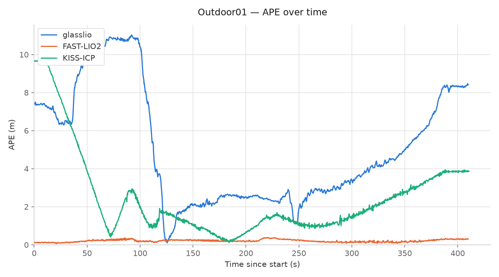
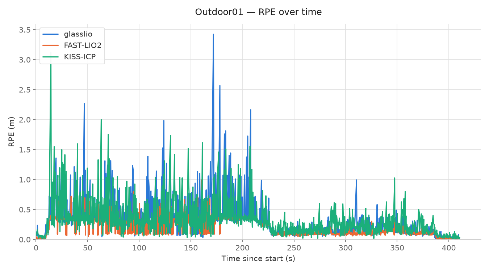

# Benchmark: glasslio vs FAST-LIO2 vs KISS-ICP (M3DGR)

Not a pipeline stage — a comparison against two established LiDAR(-inertial)
odometry systems on public data with real ground truth, run outside this repo's
own test bag.

Sequences: [M3DGR](https://github.com/sjtuyinjie/M3DGR)'s `Outdoor01` ("Standard"
category) and `Corridor02` ("LiDAR degeneracy" category). All three systems run as
ROS2 (Jazzy), real-time bag playback, TUM trajectories recorded from each system's
own message header stamp. `evo_ape`/`evo_rpe`: TUM, SE(3) Umeyama alignment (`-a`),
`--t_max_diff 0.05`, translation part. Path length via `evo_traj` (unaligned, raw
estimate scale).

glasslio = this repo, `config/livox_mid_360.yaml` (tight coupling on,
`imu_prior_weight: 1.0`). FAST-LIO2 = official `hku-mars/FAST_LIO` ROS2 branch,
config ported from M3DGR's own author-tuned ROS1 baseline (`Fast_LIO2_M3DGR`) — same
extrinsic, same filter/mapping params, `extrinsic_est_en: false`. KISS-ICP = official
`PRBonn/kiss-icp` ROS2 wrapper, default config, fed a PointCloud2 conversion of the
same bag (LiDAR-only, no IMU).

## Outdoor01

GT path length: **345.85 m**, duration 411.4 s.

| System | APE rmse | APE mean | APE median | APE min | APE max | RPE rmse | RPE mean | RPE median | RPE min | RPE max | Path length | Ratio vs GT |
|---|---|---|---|---|---|---|---|---|---|---|---|---|
| glasslio | 6.00 m | 5.12 m | 4.13 m | 0.10 m | 11.03 m | 0.394 m | 0.286 m | 0.246 m | 0.007 m | 3.424 m | 362.2 m | 1.05x |
| **FAST-LIO2** | **0.216 m** | 0.206 m | 0.200 m | 0.057 m | 0.378 m | **0.247 m** | 0.208 m | 0.181 m | 0.003 m | 0.996 m | **347.3 m** | **1.004x** |
| KISS-ICP | 3.147 m | 2.354 m | 1.543 m | 0.117 m | 9.696 m | 0.392 m | 0.301 m | 0.261 m | 0.010 m | 3.125 m | 388.7 m | 1.12x |

FAST-LIO2 tracks Outdoor01 the most accurately of the three, with path length within
0.4% of the true 345.85 m. glasslio and KISS-ICP both keep good local consistency
(RPE) but accumulate more global drift over the run (APE, path length ratio).

**APE and RPE over time:**

FAST-LIO2's APE stays low and flat for the whole run. glasslio and KISS-ICP both
oscillate — rising and falling repeatedly rather than drifting monotonically — which
is consistent with intermittent geometric degeneracy along the route rather than a
constant bias. RPE is close between all three systems throughout, with occasional
shared spikes at the same timestamps (likely sharp turns or brief degenerate
stretches that affect all three similarly).

## Corridor02

M3DGR's `GTCorridor02.txt` is a single ArUco-marker-relative reference pose (not a
full TUM trajectory) at bag_time 293 s, evaluated with M3DGR's own
`ArUco_evaluate.py`: relative transform from first to last (non-repeated) pose,
compared against the reference rotation/translation.

| System | Tracking health | Translation error (m) | Rotation error | RMSE | Tracking rate |
|---|---|---|---|---|---|
| **glasslio** | Tracked the full 293 s, zero rejected scans | **9.66** | 1.02 | 6.87 | 99.6% |
| FAST-LIO2 | Ran the full 293 s but diverged | 14,810.8 | 2.62 | 10,472.8 | 99.8% |
| **KISS-ICP** | Tracked the full 293 s | **5.31** | 0.95 | 3.81 | 100.0% |

Corridor02 is M3DGR's designated LiDAR-degeneracy sequence — a long, geometrically
sparse corridor. FAST-LIO2 diverges here (no rotational-degeneracy safeguard in this
config); glasslio and KISS-ICP both track it without diverging.

## Methodology notes

- All three systems on ROS2 Jazzy, real-time bag playback (no `use_sim_time`), TUM
  recording keyed off each system's own message header stamp.
- FAST-LIO2 consumes the raw `livox_ros_driver2/msg/CustomMsg` topic directly (native
  Livox per-point-timestamp deskew) via a from-source build of `Livox-SDK2` +
  `livox_ros_driver2` + `hku-mars/FAST_LIO` (`ROS2` branch, patched from C++14 to
  C++17 for Jazzy's rclcpp headers).
- KISS-ICP consumes a `sensor_msgs/PointCloud2` conversion of the same bag (IMU
  unused — pure LiDAR odometry).
- Single run per system per sequence. Outdoor01 in particular showed run-to-run
  variance under CPU load in testing — treat these numbers as accurate to roughly
  ±30-50%, not exact, without repeated trials.
- Corridor02's GT is a single relative-pose check, not a full trajectory — it can't
  localize where along the corridor an error originates, only the net effect at the
  end.

glasslio's tight-coupling implementation and its deskew/degeneracy-gate interaction
are documented in [5-registration.md](5-registration.md) (§3.6.1, §3.7–3.14) and
[3-deskew.md](3-deskew.md).
